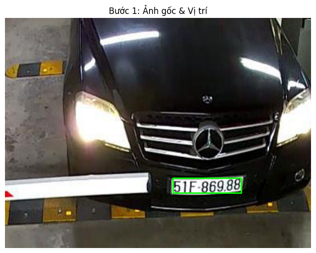
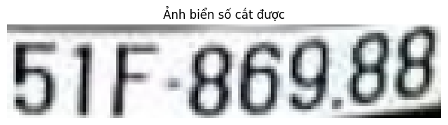
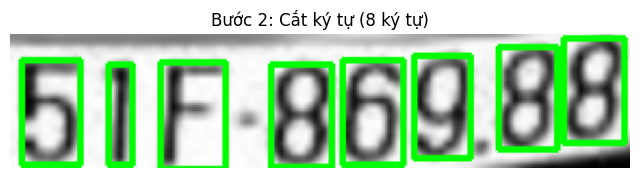
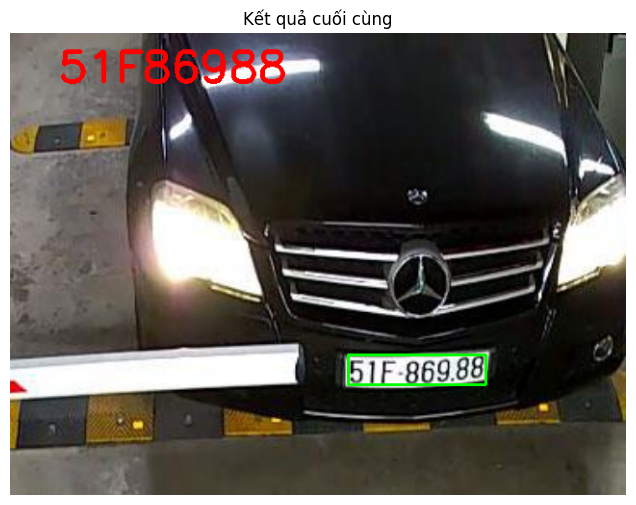
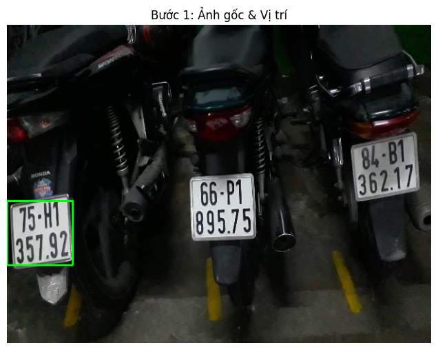
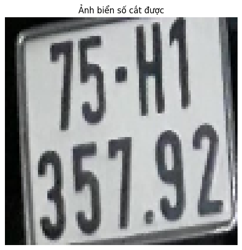
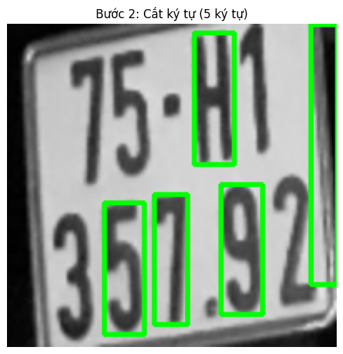
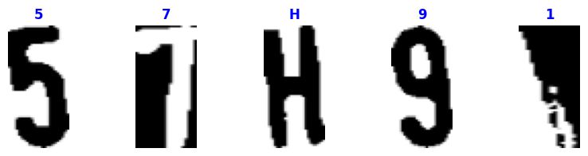
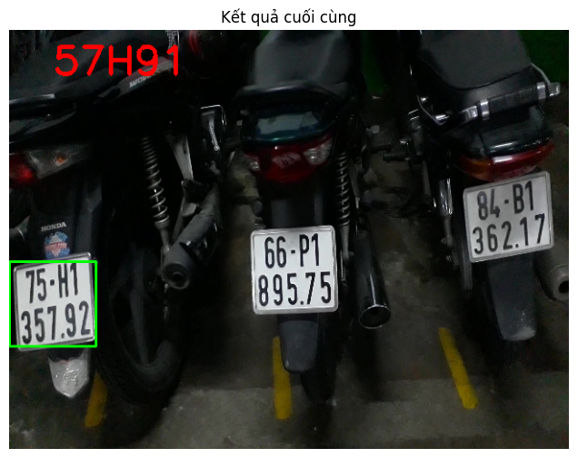

# BÀI TẬP XÂY DỰNG HỆ THỐNG NHẬN DIỆN BIỂN SỐ XE

## Thành Viên Nhóm

| STT | Họ và Tên | Mã số sinh viên|
|:---:|:---|:---|
| 1 | **Nguyễn Phước Toàn** | 2351267278 |
| 2 | **Nguyễn Hữu Tuấn Phát** | 2351267274 |
| 3 | **Đỗ Lê Tuấn Anh** | 2351267254 |

## Giới thiệu:

- Hệ thống nhận diện biển số xe là 1 trong những ứng dụng và bài toán vô cùng phổ biến hiện nay, được áp dụng rộng rãi và mang tính học thuật cao.
- Ở bài báo cao này, nhóm chúng em sẽ thực hiện báo cáo về hệ thống nhận diện biển số xe thông qua việc sử dụng các thuật toán và phương pháp trong lĩnh vực xử lý ảnh.
- Ứng dụng học máy vào nhận diện biển số xe với 3 mô hình chính:
    - KNN - K_nearest Neighbors
    - SVM - Support Vector Machine
    - CNN - Convolutional Neural Network

---

## 1. Giới thiệu chung
### Các bước chính của 1 bài toán nhận diện biển số xe
- Bước 1: License plate detection - Phát hiện biển số xe
- Bước 2: Character Segmentation - Tách ký tự
- Bước 3: Character Recognition - Nhận diện ký tự

<p align="center"></p>
<p align="center"><i>Figure 1. The main stages in the license plate recognition algorithm </i></p>

---

## 2. Các bài toán:

### 2.1 Nhận diện biển số bằng phương pháp KNN

#### 2.1.0 Các bước tiền xử lí phát hiện và tách biển số:

| Bước | Tên bước | Mô tả |
|:---:|:---|:---|
| 1 | Input ảnh đầu vào | Đọc ảnh gốc từ file |
| 2 | Chuyển sang ảnh xám | Sử dụng hệ màu HSV, trích xuất kênh V (Value) |
| 3 | Tăng độ tương phản | Áp dụng Top-hat và Black-hat morphology |
| 4 | Giảm nhiễu bằng bộ lọc Gauss | Gaussian Blur với kernel 5x5 |
| 5 | Nhị phân hóa ảnh với ngưỡng động | Adaptive Threshold (block size=19, weight=9) |
| 6 | Phát hiện cạnh Canny | Canny Edge Detection (250, 255) |
| 7 | Tìm vị trí và lọc biển số Contour | Tìm contour 4 cạnh, lọc theo tỉ lệ |

<p align="center"></p>
<p align="center"><i>Figure 2. The main stages in detecting and extract the license plate </i></p>

#### Chi tiết về tiền xử lí (Preprocess.py):

```python

def extractValue(imgOriginal):
    imgHSV = cv2.cvtColor(imgOriginal, cv2.COLOR_BGR2HSV)
    imgHue, imgSaturation, imgValue = cv2.split(imgHSV)
    return imgValue

def maximizeContrast(imgGrayscale):
    structuringElement = cv2.getStructuringElement(cv2.MORPH_RECT, (3, 3))
    imgTopHat = cv2.morphologyEx(imgGrayscale, cv2.MORPH_TOPHAT, structuringElement, iterations=10)
    imgBlackHat = cv2.morphologyEx(imgGrayscale, cv2.MORPH_BLACKHAT, structuringElement, iterations=10)
    return cv2.subtract(cv2.add(imgGrayscale, imgTopHat), imgBlackHat)
```

Ở phạm vi đồ án này, ta chủ yếu nhận diện biển số từ sự thay đổi về cường độ giữa biển số và môi trường, nên ta sẽ loại bỏ dữ liệu màu sắc RGB bằng cách chuyển sang ảnh xám. Tiếp theo ta tăng độ tương phản với hai phép toán hình thái học **Top-hat** và **Black-hat** để làm nổi bật thêm biển số giữa phông nền, hỗ trợ cho việc xử lí nhị phân sau này. Sau đó, ta giảm nhiễu bằng **Gaussian Filter** để loại bỏ những chi tiết có thể gây ảnh hưởng đến quá trình nhận diện, đồng thời làm tăng tốc độ xử lí.

<p align="center"></p>
<p align="center"><i>Figure 3. Maximize Contrast - Top-hat và Black-hat morphology</i></p>

Việc lấy ngưỡng sẽ giúp ta tách được thông tin biển số và thông tin nền, ở đây chọn lấy ngưỡng động (**Adaptive Threshold**). Tiếp đó ta sử dụng thuật toán phát hiện cạnh **Canny** để trích xuất những chi tiết cạnh của biển số. Trong quá trình xử lí máy tính có thể nhầm lẫn biển số với những chi tiết nhiễu, việc lọc lần cuối bằng tỉ lệ cao/rộng (lọc thông cao và thông thấp) hay diện tích của biển số sẽ giúp xác định được biển số. Cuối cùng ta sẽ xác định vị trí của biển số trong ảnh bằng cách vẽ **Contour** bao quanh.

<p align="center"></p>
<p align="center"><i>Figure 4. Threshold Image - Nhị phân hóa ảnh</i></p>

<p align="center"></p>
<p align="center"><i>Figure 5. Drawing contour and extract the information</i></p>

#### 2.1.1 Phân tách ký tự

Đầu tiên cần xoay biển số về đúng chính diện.

**Phương pháp xoay ảnh sử dụng ở đây là:**
- Lọc ra từ tọa độ 2 đỉnh A, B nằm dưới cùng của biển số
- Từ 2 đỉnh có tọa độ lần lượt là A(x1, y1) và B(x2, y2) ta có thể tính được cạnh đối và cạnh kề của tam giác ABC
- Tính góc quay bằng `tan(angle) = đối/kề`
- Xoay ảnh theo góc đã tính. Nếu ngược lại điểm A nằm cao hơn điểm B ta cho góc quay âm.

```python
doi = abs(y1 - y2)
ke = abs(x1 - x2)
angle = math.atan(doi / ke) * (180.0 / math.pi)

if x1 < x2:
    rotationMatrix = cv2.getRotationMatrix2D(ptPlateCenter, -angle, 1.0)
else:
    rotationMatrix = cv2.getRotationMatrix2D(ptPlateCenter, angle, 1.0)
roi = cv2.warpAffine(roi, rotationMatrix, (width, height))
```

<p align="center"></p>
<p align="center"><i>Figure 6. Rotate the license plate - Xoay biển số về chính diện</i></p>

Từ ảnh nhị phân, ta tìm contour cho các ký tự (phần màu trắng). Sau đó vẽ những hình chữ nhật bao quanh các ký tự đó. Tuy nhiên việc tìm contour này cũng bị nhiễu dẫn đến việc máy xử lí sai mà tìm ra những hình ảnh không phải ký tự. Ta sẽ áp dụng các đặc điểm về tỉ lệ chiều cao/rộng của ký tự, diện tích của ký tự so với biển số để lọc:

```python
Min_char = 0.01
Max_char = 0.09
if (Min_char * roiarea < char_area < Max_char * roiarea) and (0.25 < ratiochar < 0.7):
```

<p align="center"></p>
<p align="center"><i>Figure 7. Character Segmentation - Tách từng ký tự</i></p>

#### 2.1.2 Nhận diện ký tự với KNN

**K-Nearest Neighbors (KNN)** là một trong những loại supervised learning đơn giản nhất trong Machine Learning, hoạt động theo quy trình gồm 4 bước chính:

| Bước | Mô tả |
|:---:|:---|
| 1 | Xác định tham số K (số láng giềng gần nhất, mặc định K=3) |
| 2 | Tính khoảng cách từ điểm đang xét đến tất cả các điểm trong tập dữ liệu cho trước |
| 3 | Sắp xếp các khoảng cách đó theo thứ tự tăng dần |
| 4 | Xét trong tập K điểm gần nhất với điểm đang xét, nếu số lượng điểm của loại nào cao hơn thì coi như điểm đang xét thuộc loại đó |

**Chuẩn hóa dữ liệu:**
- Mỗi ký tự có kích thước khác nhau, xử lí phức tạp nên cần chuẩn hóa hình ảnh lại với kích thước **30x20 pixel** (tổng cộng 600 features)
- Các ký tự sẽ được gắn nhãn bằng mã ASCII tương ứng
- File `classification.txt` lưu các mã ASCII của ký tự
- File `flattened_images.txt` lưu ma trận flatten của các kí tự (giá trị 0 hoặc 255)

```python

@dataclass(frozen=True)
class KNNConfig:
    resized_image_width: int = 20
    resized_image_height: int = 30
    k: int = 3

    @property
    def feature_len(self) -> int:
        return self.resized_image_width * self.resized_image_height  # 600 features

def predict_char(model, flattened_row, k=3) -> str:
    row = np.asarray(flattened_row, dtype=np.float32).reshape((1, -1))
    _ret, results, _neigh_resp, _dists = model.findNearest(row, k=k)
    return chr(int(results[0][0]))

```

<p align="center"></p>
<p align="center"><i>Figure 8. Print license plate number - Kết quả nhận diện</i></p>

#### 2.1.3 Thử nghiệm mô hình KNN

Ta thử nghiệm mô hình trên 2 hình ảnh (2 ảnh này sẽ được thử nghiệm trên tất cả các mô hình):

<p align="center"></p>
<p align="center"><i>Figure 9. Image 1 - Ảnh thử nghiệm 1</i></p>

<p align="center"></p>
<p align="center"><i>Figure 10. Image 2 - Ảnh thử nghiệm 2</i></p>

**Kết quả với Image 1:**

| Bước | Kết quả |
|:---:|:---:|
|  |  |
| Figure 11. Input Image | Figure 12. Preprocessing |
|  |  |
| Figure 13. Threshold | Figure 14. Contour Detection |
|  |  |
| Figure 15. Character Segmentation | Figure 16. Character Recognition |

**Kết quả với Image 2:**

<p align="center"></p>
<p align="center"><i>Figure 17. Image 2 - Input</i></p>

<p align="center"></p>
<p align="center"><i>Figure 18. Image 2 - Character Detection</i></p>

<p align="center"></p>
<p align="center"><i>Figure 19. Image 2 - Final Result</i></p>

---

### 2.2 Mô hình CNN nhận diện ký tự dạng nhị phân (CNN_threshold)

#### 2.2.0 Giới thiệu

Mô hình **CNN_threshold** sử dụng cùng pipeline tiền xử lý như KNN (bao gồm các bước phát hiện biển số, xoay ảnh, tách ký tự), nhưng thay vì sử dụng KNN để nhận diện ký tự, ta sử dụng mạng **Convolutional Neural Network (CNN)** với đầu vào là ảnh nhị phân (binary/threshold image).

#### 2.2.1 Kiến trúc mạng CNN

**Pipeline kiến trúc CNN chi tiết:**

<p align="center"></p>
<p align="center"><i>Figure 20. Pipeline kiến trúc CNN chi tiết</i></p>

**Mã nguồn kiến trúc:**

```python
model = Sequential(

    Conv2d(3, 3, kernel_size=3, stride=1, padding=1, groups=3, bias=False),  # depthwise
    BatchNorm2d(3),
    torch.nn.ReLU(inplace=True),
    Conv2d(3, 32, kernel_size=1, bias=False),  # pointwise
    BatchNorm2d(32),
    torch.nn.ReLU(inplace=True),
    MaxPool2d(2),


    Conv2d(32, 64, kernel_size=3, padding=1, bias=False),
    BatchNorm2d(64),
    torch.nn.ReLU(inplace=True),
    MaxPool2d(2),

    torch.nn.AdaptiveAvgPool2d((1, 1)),
    Flatten(),
    Linear(64, 128),
    torch.nn.ReLU(inplace=True),
    Linear(128, num_classes),  # num_classes = 35
)
```

**Bảng tóm tắt các lớp:**

| STT | Lớp | Input Shape | Output Shape | Mô tả |
|:---:|:---|:---:|:---:|:---|
| 1 | Conv2d (Depthwise) | 64×64×3 | 64×64×3 | Convolution riêng từng kênh |
| 2 | BatchNorm2d | 64×64×3 | 64×64×3 | Chuẩn hóa batch |
| 3 | ReLU | 64×64×3 | 64×64×3 | Activation function |
| 4 | Conv2d (Pointwise) | 64×64×3 | 64×64×32 | Kết hợp kênh với kernel 1×1 |
| 5 | BatchNorm2d | 64×64×32 | 64×64×32 | Chuẩn hóa batch |
| 6 | ReLU | 64×64×32 | 64×64×32 | Activation function |
| 7 | MaxPool2d | 64×64×32 | 32×32×32 | Giảm kích thước 2× |
| 8 | Conv2d | 32×32×32 | 32×32×64 | Standard convolution |
| 9 | BatchNorm2d | 32×32×64 | 32×32×64 | Chuẩn hóa batch |
| 10 | ReLU | 32×32×64 | 32×32×64 | Activation function |
| 11 | MaxPool2d | 32×32×64 | 16×16×64 | Giảm kích thước 2× |
| 12 | AdaptiveAvgPool2d | 16×16×64 | 1×1×64 | Global Average Pooling |
| 13 | Flatten | 1×1×64 | 64 | Chuyển thành vector |
| 14 | Linear | 64 | 128 | Fully connected |
| 15 | ReLU | 128 | 128 | Activation function |
| 16 | Linear | 128 | 35 | Output layer |

#### 2.2.2 Huấn luyện mô hình

**Cấu hình huấn luyện:**

| Tham số | Giá trị |
|:---|:---|
| Dataset | License Plate Digits Classification Dataset (Kaggle) |
| Input size | 64 × 64 × 3 |
| Số lớp (classes) | 35 (0-9, A-Z trừ I, O, Q) |
| Train/Val split | 80% / 20% |
| Batch size | 32 |
| Optimizer | Adam (lr=0.001) |
| Loss function | CrossEntropyLoss |
| Max epochs | 50 |
| Early stopping | Patience = 10 |

**Kết quả huấn luyện:**

| Epoch | Train Loss | Train Acc | Val Loss | Val Acc |
|:---:|:---:|:---:|:---:|:---:|
| 1 | 2.1381 | 32.87% | 3.1243 | 15.39% |
| 10 | 0.9296 | 72.90% | 0.9443 | 72.63% |
| 20 | 0.4823 | 85.99% | 0.7102 | 78.00% |
| 27 | 0.3377 | 90.04% | 0.3186 | **90.25%** |
| 36 | 0.2137 | 93.83% | 0.4937 | 84.41% |

- **Best Validation Accuracy: 90.25%** (Epoch 27)
- Early stopping triggered tại Epoch 36
- Final Model Accuracy: 87.86%

#### 2.2.3 Thử nghiệm mô hình CNN_threshold

**Kết quả với Image 1:**

<p align="center"></p>
<p align="center"><i>Figure 20. CNN_threshold - Preprocessing</i></p>

<p align="center"></p>
<p align="center"><i>Figure 21. CNN_threshold - Character Detection</i></p>

<p align="center"></p>
<p align="center"><i>Figure 22. CNN_threshold - Result Image 1</i></p>

**Kết quả với Image 2:**

<p align="center"></p>
<p align="center"><i>Figure 23. CNN_threshold - Detection Image 2</i></p>

<p align="center"></p>
<p align="center"><i>Figure 24. CNN_threshold - Result Image 2</i></p>

---

### 2.3 Mô hình CNN nhận diện ký tự dạng ảnh màu (CNN)

#### 2.3.0 Giới thiệu

Mô hình **CNN** sử dụng phương pháp phát hiện biển số tiên tiến hơn với **U-Net Segmentation** để phát hiện vùng biển số chính xác hơn, kết hợp với **Perspective Transform** để cắt và căn chỉnh biển số. Đầu vào cho mạng nhận diện ký tự là ảnh màu RGB thay vì ảnh nhị phân.

#### 2.3.1 Kiến trúc U-Net Small (Plate Segmentation Model)

**U-Net** là kiến trúc mạng nơ-ron tích chập được thiết kế đặc biệt cho bài toán **semantic segmentation**. Trong đồ án này, nhóm sử dụng phiên bản **U-Net Small** được tối ưu hóa cho việc phát hiện vùng biển số xe.

**Kiến trúc U-Net Small Pipeline:**

<p align="center"></p>
<p align="center"><i>Figure 25. U-Net Small Pipeline</i></p>

**Thành phần DoubleConv Block:**

Mỗi block trong U-Net Small sử dụng **DoubleConv** - hai lớp convolution liên tiếp:

```python
class DoubleConv(nn.Module):
    def __init__(self, in_ch: int, out_ch: int) -> None:
        super().__init__()
        self.net = nn.Sequential(
            nn.Conv2d(in_ch, out_ch, 3, padding=1, bias=False),
            nn.BatchNorm2d(out_ch),
            nn.ReLU(inplace=True),
            nn.Conv2d(out_ch, out_ch, 3, padding=1, bias=False),
            nn.BatchNorm2d(out_ch),
            nn.ReLU(inplace=True),
        )
```

**Mã nguồn kiến trúc U-Net Small:**

```python
class UNetSmall(nn.Module):

    def __init__(self, base: int = 32) -> None:
        super().__init__()
        
        self.down1 = DoubleConv(3, base)           # 3 → 32
        self.pool1 = nn.MaxPool2d(2)
        self.down2 = DoubleConv(base, base * 2)    # 32 → 64
        self.pool2 = nn.MaxPool2d(2)
        self.down3 = DoubleConv(base * 2, base * 4) # 64 → 128
        self.pool3 = nn.MaxPool2d(2)
        
        self.bottleneck = DoubleConv(base * 4, base * 8)  # 128 → 256
        
        self.up3 = nn.ConvTranspose2d(base * 8, base * 4, 2, stride=2)
        self.conv3 = DoubleConv(base * 8, base * 4)  # 256 → 128
        
        self.up2 = nn.ConvTranspose2d(base * 4, base * 2, 2, stride=2)
        self.conv2 = DoubleConv(base * 4, base * 2)  # 128 → 64
        
        self.up1 = nn.ConvTranspose2d(base * 2, base, 2, stride=2)
        self.conv1 = DoubleConv(base * 2, base)      # 64 → 32
        
        self.head = nn.Conv2d(base, 1, kernel_size=1)  # 32 → 1

    def forward(self, x: torch.Tensor) -> torch.Tensor:

        x1 = self.down1(x)
        x2 = self.down2(self.pool1(x1))
        x3 = self.down3(self.pool2(x2))
        xb = self.bottleneck(self.pool3(x3))
        

        u3 = self.up3(xb)
        u3 = torch.cat([u3, x3], dim=1)  # Skip connection
        u3 = self.conv3(u3)
        
        u2 = self.up2(u3)
        u2 = torch.cat([u2, x2], dim=1)  # Skip connection
        u2 = self.conv2(u2)
        
        u1 = self.up1(u2)
        u1 = torch.cat([u1, x1], dim=1)  # Skip connection
        u1 = self.conv1(u1)
        
        return self.head(u1)
```

**Bảng tóm tắt các lớp U-Net Small (base=32):**

| Phần | Lớp | Input Channels | Output Channels | Output Size (H=256) |
|:---|:---|:---:|:---:|:---:|
| **Encoder** | down1 (DoubleConv) | 3 | 32 | 256 × 256 |
| | pool1 (MaxPool2d) | 32 | 32 | 128 × 128 |
| | down2 (DoubleConv) | 32 | 64 | 128 × 128 |
| | pool2 (MaxPool2d) | 64 | 64 | 64 × 64 |
| | down3 (DoubleConv) | 64 | 128 | 64 × 64 |
| | pool3 (MaxPool2d) | 128 | 128 | 32 × 32 |
| **Bottleneck** | bottleneck (DoubleConv) | 128 | 256 | 32 × 32 |
| **Decoder** | up3 (ConvTranspose2d) | 256 | 128 | 64 × 64 |
| | concat + conv3 | 256 | 128 | 64 × 64 |
| | up2 (ConvTranspose2d) | 128 | 64 | 128 × 128 |
| | concat + conv2 | 128 | 64 | 128 × 128 |
| | up1 (ConvTranspose2d) | 64 | 32 | 256 × 256 |
| | concat + conv1 | 64 | 32 | 256 × 256 |
| **Head** | head (Conv2d 1×1) | 32 | 1 | 256 × 256 |

**Đặc điểm chính của U-Net Small:**

| Đặc điểm | Mô tả |
|:---|:---|
| **Skip Connections** | Kết nối trực tiếp từ encoder sang decoder giúp bảo toàn thông tin không gian |
| **Symmetric Architecture** | Encoder và Decoder có cấu trúc đối xứng |
| **Base Channels** | base=32 (có thể điều chỉnh để tăng/giảm capacity) |
| **Input** | Ảnh RGB 3×H×W |
| **Output** | Segmentation mask 1×H×W (logits) |
| **Activation** | Sigmoid để chuyển logits thành xác suất [0,1] |

#### 2.3.2 Pipeline xử lý tổng quan

<p align="center"></p>
<p align="center"><i>Figure 26. Pipeline xử lý tổng quan</i></p>

#### 2.3.3 Các phương pháp phát hiện ký tự

**1. MSER (Maximally Stable Extremal Regions):**

```python
def detect_characters_mser(gray_img, min_area=50, max_area=3000, 
                           min_aspect=0.15, max_aspect=0.9):
    mser = cv2.MSER_create()
    mser.setDelta(5)
    mser.setMinArea(min_area)
    mser.setMaxArea(max_area)
    mser.setMaxVariation(0.25)
    mser.setMinDiversity(0.2)
    
    regions, _ = mser.detectRegions(gray_img)

```

**2. Contour-based:**

```python
def detect_characters_contour(bgr_img, gray_img=None):
    gray_blur = cv2.GaussianBlur(gray, (3, 3), 0)
    _, thresh = cv2.threshold(gray_blur, 0, 255, 
                              cv2.THRESH_BINARY_INV | cv2.THRESH_OTSU)
    kernel = cv2.getStructuringElement(cv2.MORPH_RECT, (2, 2))
    thresh = cv2.morphologyEx(thresh, cv2.MORPH_CLOSE, kernel)
    contours, _ = cv2.findContours(thresh, cv2.RETR_EXTERNAL, 
                                   cv2.CHAIN_APPROX_SIMPLE)

```

**3. Auto Mode (Hybrid):**

```python
def detect_characters_auto(bgr_img, gray_img, min_expected=4, max_expected=12):
    mser_boxes = detect_characters_mser(gray_img)
    contour_boxes = detect_characters_contour(bgr_img, gray_img)
```

#### 2.3.4 Position-based Character Recognition

Để tăng độ chính xác, mô hình áp dụng ràng buộc dựa trên vị trí ký tự trong biển số Việt Nam:

```python
def predict_char_with_position(model, classes, device, img_roi, position):
    logits = model(x)
    masked_logits = logits.clone()
    
    if position in (0, 1):
        for i, cls in enumerate(classes):
            if cls.upper() not in DIGITS:
                masked_logits[0, i] = float('-inf')
    elif position == 2:
        for i, cls in enumerate(classes):
            if cls.upper() not in ALPHABET:
                masked_logits[0, i] = float('-inf')
    else:
        for i, cls in enumerate(classes):
            if cls.upper() not in DIGITS:
                masked_logits[0, i] = float('-inf')
    
    return classes[torch.argmax(masked_logits)]
```

#### 2.3.5 Thử nghiệm mô hình CNN

**Kết quả với Image 1:**

<p align="center"></p>
<p align="center"><i>Figure 25. CNN - Input Image 1</i></p>

<p align="center"></p>
<p align="center"><i>Figure 26. CNN - Plate Mask (U-Net output)</i></p>

<p align="center"></p>
<p align="center"><i>Figure 27. CNN - Detected Plate Contour</i></p>

<p align="center"></p>
<p align="center"><i>Figure 28. CNN - Warped Plate</i></p>

<p align="center"></p>
<p align="center"><i>Figure 29. CNN - Character Recognition Result</i></p>

**Kết quả với Image 2:**

<p align="center"></p>
<p align="center"><i>Figure 30. CNN - Input Image 2</i></p>

<p align="center"></p>
<p align="center"><i>Figure 31. CNN - Plate Mask Image 2</i></p>

<p align="center"></p>
<p align="center"><i>Figure 32. CNN - Detected Plate Image 2</i></p>

<p align="center"></p>
<p align="center"><i>Figure 33. CNN - Warped Plate Image 2</i></p>

<p align="center"></p>
<p align="center"><i>Figure 34. CNN - Character Recognition Image 2</i></p>

<p align="center"></p>
<p align="center"><i>Figure 35. CNN - Final Result Image 2</i></p>

---

### 2.4 Mô hình Support Vector Machine (SVM)

#### 2.4.0 Giới thiệu

**Support Vector Machine (SVM)** là một thuật toán supervised learning mạnh mẽ, đặc biệt hiệu quả cho bài toán phân loại. SVM tìm siêu phẳng (hyperplane) tối ưu để phân tách các lớp dữ liệu với margin lớn nhất.

#### 2.4.1 Trích xuất đặc trưng HOG

Khác với KNN sử dụng pixel trực tiếp, SVM sử dụng **HOG (Histogram of Oriented Gradients)** để trích xuất đặc trưng từ ảnh ký tự:

```python
def get_hog_features(image):
    image = cv2.resize(image, (30, 60))
    
    hog = cv2.HOGDescriptor((30, 60), (10, 20), (5, 10), (5, 10), 9)
    h = hog.compute(image)
    return h.flatten()
```

**Giải thích tham số HOG:**

| Tham số | Giá trị | Mô tả |
|:---|:---:|:---|
| winSize | (30, 60) | Kích thước cửa sổ (width × height) |
| blockSize | (10, 20) | Kích thước block |
| blockStride | (5, 10) | Bước nhảy giữa các block |
| cellSize | (5, 10) | Kích thước cell |
| nbins | 9 | Số bin cho histogram hướng gradient |

#### 2.4.2 Huấn luyện mô hình SVM

```python
# Cấu hình SVM
model = SVC(kernel='linear', C=1.0, probability=True)

# Chia dữ liệu train/test
X_train, X_test, y_train, y_test = train_test_split(X, y, test_size=0.2, random_state=42)

# Huấn luyện
model.fit(X_train, y_train)

# Đánh giá
y_pred = model.predict(X_test)
accuracy = accuracy_score(y_test, y_pred)
```

**Kết quả huấn luyện:**

| Metric | Giá trị |
|:---|:---|
| Tổng số mẫu | 1047 |
| Train/Test split | 80% / 20% |
| Kernel | Linear |
| C (Regularization) | 1.0 |
| **Test Accuracy** | **97.14%** |

#### 2.4.3 Pipeline xử lý SVM

```
┌──────────────────────────────────────────────────────────────────────────┐
│                         SVM PIPELINE                                      │
├──────────────────────────────────────────────────────────────────────────┤
│                                                                          │
│  INPUT: Character Image (from segmentation)                               │
│    ↓                                                                     │
│  Grayscale conversion                                                     │
│    ↓                                                                     │
│  Resize to 30 × 60                                                       │
│    ↓                                                                     │
│  HOG Feature Extraction                                                   │
│    - Block normalization                                                  │
│    - Gradient computation                                                 │
│    - Histogram binning                                                    │
│    ↓                                                                     │
│  Feature Vector (1D array)                                                │
│    ↓                                                                     │
│  SVM Classifier                                                           │
│    - Find optimal hyperplane                                              │
│    - Calculate decision boundary                                          │
│    ↓                                                                     │
│  OUTPUT: Predicted Character Class                                        │
│                                                                          │
└──────────────────────────────────────────────────────────────────────────┘
```

#### 2.4.4 Thử nghiệm mô hình SVM

**Kết quả với Image 1:**

<p align="center"></p>
<p align="center"><i>Figure 36. SVM - Input Image 1</i></p>

<p align="center"></p>
<p align="center"><i>Figure 37. SVM - Preprocessing</i></p>

<p align="center"></p>
<p align="center"><i>Figure 38. SVM - Plate Detection</i></p>

<p align="center"></p>
<p align="center"><i>Figure 39. SVM - Character Recognition Result</i></p>

<p align="center"></p>
<p align="center"><i>Figure 40. SVM - Input Image 2</i></p>

**Kết quả với Image 2:**

<p align="center"></p>
<p align="center"><i>Figure 41. SVM - Detection Image 2</i></p>

<p align="center"></p>
<p align="center"><i>Figure 42. SVM - Character Recognition Image 2</i></p>

<p align="center"></p>
<p align="center"><i>Figure 43. SVM - Character Recognition Image 2</i></p> 

<p align="center"></p>
<p align="center"><i>Figure 44. SVM - Character Recognition Image 2</i></p> 

<p align="center"></p>
<p align="center"><i>Figure 45. SVM - Character Recognition Image 2</i></p> 

---

## 3. So sánh các mô hình

### 3.1 Bảng so sánh tổng quan

| Tiêu chí | KNN | CNN_threshold | CNN | SVM |
|:---|:---:|:---:|:---:|:---:|
| **Phương pháp phát hiện biển số** | Contour + Canny | Contour + Canny | U-Net Segmentation | Contour + Canny |
| **Đầu vào nhận diện** | Binary (20×30) | Binary (64×64 RGB) | Color (64×64 RGB) | HOG features |
| **Số lượng classes** | ASCII chars | 35 | 35 | 31 |
| **Khả năng xử lý nhiễu** | Thấp | Trung bình | Cao | Trung bình |

### 3.2 Ưu điểm và nhược điểm

#### KNN
| Ưu điểm | Nhược điểm |
|:---|:---|
| Đơn giản, dễ hiểu | Độ chính xác phụ thuộc vào K |
| Không cần training mất thời gian | Độ chính xác khi nhận diện kí tự là cực thấp |
| Hoạt động tốt khi thiết lập chính xác các thông số | Nhạy cảm với nhiễu |

#### CNN_threshold
| Ưu điểm | Nhược điểm |
|:---|:---|
| Học được đặc trưng tự động | Cần GPU để train |
| Độ chính xác cao hơn so với CNN | Phụ thuộc vào chất lượng ảnh nhị phân |

#### CNN
| Ưu điểm | Nhược điểm |
|:---|:---|
| Phát hiện biển số chính xác với U-Net | Segmentation model chưa xử lí tốt ở môi trường nhiễu |
| CNN OCR | Độ chính xác thấp do thiếu dữ liệu huấn luyện |
| Xử lý tốt ảnh nghiêng | Tốc độ chậm hơn |

#### SVM
| Ưu điểm | Nhược điểm |
|:---|:---|
| Độ chính xác nhận diện kí tự cao | Cần thiết kế feature thủ công |
| Hoạt động tốt với thiết bị yếu | HOG có thể không tối ưu cho mọi trường hợp |

---

## 4. Kết luận

Qua quá trình thực hiện đồ án, nhóm đã xây dựng thành công hệ thống nhận diện biển số xe với 4 mô hình khác nhau:

1. **KNN**: Phương pháp đơn giản, phù hợp cho học tập và nghiên cứu bởi kết quả cho ra sai số rất nhiều, đặc biệt ở phần nhận diện vị trí biển số và nhận diện kí tự
2. **CNN_threshold**: Kết hợp tiền xử lý truyền thống với deep learning
3. **CNN kết hợp model segmentation**: Pipeline hoàn chỉnh với Segmentation model đem lại độ chính xác khi nhận diện vị trí biển số xe, tuy nhiên, model CNN nhận diện kí tự cho ra kết quả không chính xác cao
4. **SVM**: Độ chính xác cực cao khi nhận diện kí tự, nếu kết hợp với Segmentation Model có thể sẽ đạt kết quả tốt

**Nhận xét:**
- Mô hình SVM cho kết quả nhận diện kí tự tốt nhất
- Mô hình CNN đầy đủ có khả năng xử lý tốt các trường hợp biển số nghiêng nhờ Segmentation Model tuy nhiên model nhận diện kí tự cần được cải thiện
- KNN đơn giản nhưng vẫn hoạt động ổn định cho các trường hợp cơ bản
- Điểm yếu chung của cả 4 phương án là ở khả năng phân tách kí tự khi chỉ đang dùng thuật toán cố định để đặt tỉ lệ và phân tách kí tự.

---

## 5. Định hướng phát triển

1. **Cải thiện phát hiện biển số:**
   - Mở rộng kiến trúc, nghiên cứu dùng kiến trúc Unet thay vì Unet small - để có khả năng nhận diện biển số ở nhiều gốc độ

2. **Tăng cường dữ liệu:**
   - Tăng cường dữ liệu cho huấn luyện Segmation model và CNN model

3. **Xây dựng mô hình cho nhận diện kí tự, hỗ trợ tách kí tự:**
   - Nghiên cứu xây dựng mô hình CRNN cho nhận diện kí tự, hỗ trợ tách kí tự

4. **Tích hợp các mô hình hiện đại, phổ biến vào đồ án:**
   - Cải thiện hiệu quả nhận diện bằng YOLO11 giúp cải thiện hiệu quả nhận diện trong môi trường phức tạp
   - Dùng các model OCR phổ biến hiện nay để có thể dự đoán chính xác hơn trong môi trường phức tạp

5. **Thêm khả năng nhận diện biển số qua video - camera live**


---

## 6. Tài liệu tham khảo

1. OpenCV Documentation: https://docs.opencv.org/
2. PyTorch Documentation: https://pytorch.org/docs/
3. scikit-learn SVM: https://scikit-learn.org/stable/modules/svm.html
4. License Plate Digits Classification Dataset: https://www.kaggle.com/datasets/aladdinss/license-plate-digits-classification-dataset
5. HOG Feature Descriptor: N. Dalal and B. Triggs, "Histograms of Oriented Gradients for Human Detection"
6. U-Net: Convolutional Networks for Biomedical Image Segmentation

---

*Báo cáo được hoàn thành vào ngày 28/12/2025*